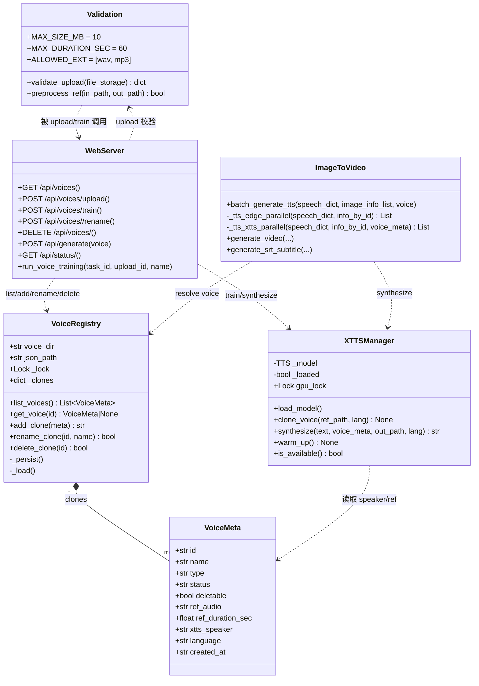
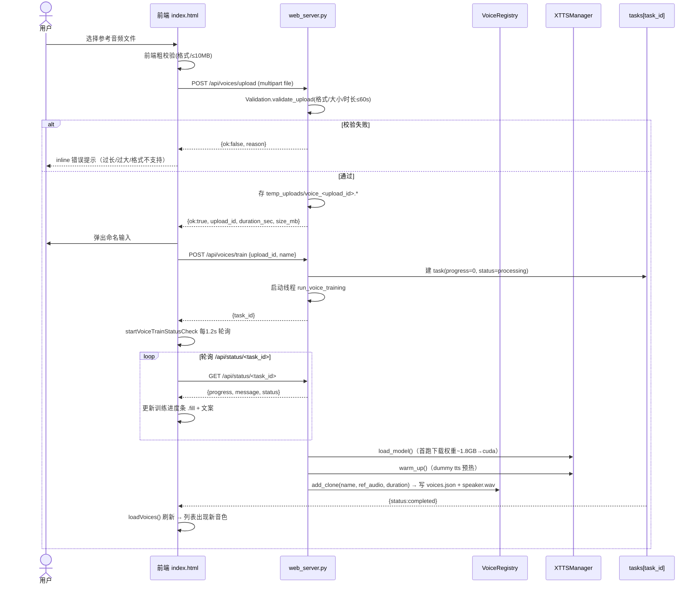
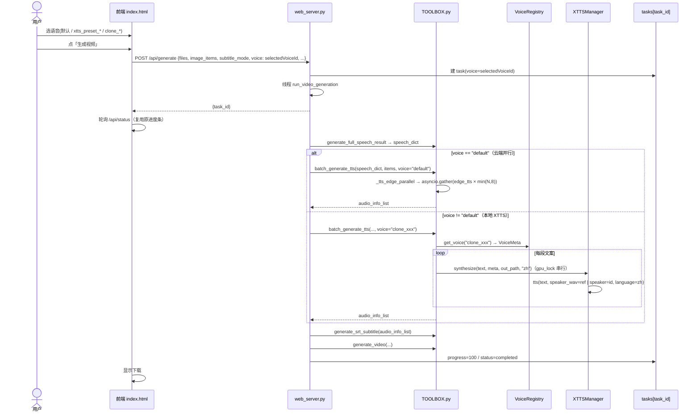
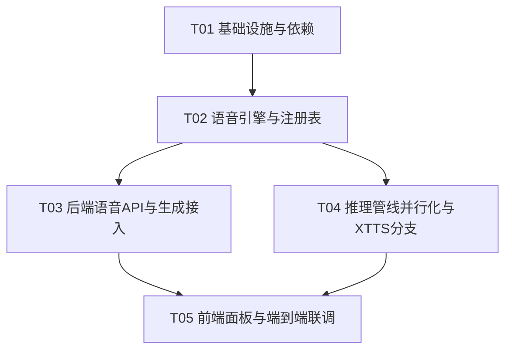

# 系统设计 + 任务分解：并行 TTS + 本地 XTTS v2 语音克隆

> 文档角色：软件架构师（高见远）　|　语言：中文　|　对应 PRD：`docs/prd_voice_clone.md`
> 范围：端到端一次性实现并行 Edge TTS + 本地 XTTS v2 零样本语音克隆 + 前端语音管理面板。
> 已确认决策（按用户拍板设计，不再反问）：克隆引擎 = Coqui XTTS v2（本地零样本，RTX 5060 ~8G）；"训练" = 参考音频加载/编码 + 模型 warm-up；范围全做；前端保持原生 JS（`static/index.html`），复用现有 Flask `tasks` 进度机制。

---

# Part A：系统设计

## 1. 实现方案（Implementation Approach）

### 1.1 技术难点分析

| 难点 | 说明 | 对策 |
|---|---|---|
| **RTX 5060 = Blackwell（sm_120）架构** | NVIDIA RTX 50 系列（Blackwell, sm_120）**实测已被 PyTorch 稳定版支持** —— 稳定版 `torch 2.13+cu126` 原生支持 sm_120，5060 上 `torch.cuda.is_available()` 为 True。 | 安装 **PyTorch 稳定版 `2.13+cu126`**（`--index-url https://download.pytorch.org/whl/cu126` 或默认 PyPI），无需 nightly。这是本方案最关键的依赖约束（已实测推翻"必须 nightly"的旧结论）。 |
| **XTTS v2 与本机 torch 版本耦合** | Coqui `TTS` 库对 torch / numba / llvmlite 版本敏感。 | 固定 `TTS>=0.22.0` + `numba`/`llvmlite` 上/下限；先装稳定版 torch(cu126) 再装 TTS，避免版本被降级。 |
| **batch_generate_tts 串行** | 现有 `batch_generate_tts()`（L927）逐条 `asyncio.run(tts_single_paragraph(...))`，未并发。 | 改为：默认路径用 `asyncio.gather` 并发 `tts_single_paragraph`，并发上限 `min(段落数, 8)`；失败段落沿用现有 3 次重试 + Windows SAPI 兜底。 |
| **默认(Edge) 与 本地(XTTS) 双 TTS 源** | 生成流程需按 `voice` 字段在两种 TTS 之间切换。 | `batch_generate_tts(speech_dict, image_info_list, voice)` 增加 `voice` 参数；`voice=="default"` 走 Edge 并发，其他走 XTTS 本地推理。返回结构保持 `{global_id, text, audio_path, duration_seconds, submaker}` 不变，`generate_video` / `generate_srt_subtitle` 无需改动（字幕已不依赖 `submaker`，改用 faster-whisper 对齐）。 |
| **XTTS 模型加载成本** | 首次加载权重约 1.8GB（HuggingFace 下载）+ GPU warm-up 耗时数秒~数十秒。 | **懒加载 + 进程内单例缓存**：`XTTSManager` 类级单例，首次调用 `load_model()` 下载并加载到 `cuda`，后续推理复用；"训练"任务即触发加载 + warm-up，进度条映射该过程。 |
| **CUDA 显存争用（Q7）** | 5060 约 8G，XTTS 推理与视频 CUDA 合成可能争用。 | ① **同一生成任务内天然串行**：`run_video_generation` 中 TTS 在进度 ~60 完成，视频 CUDA 链在 ~78+ 才启动，因此单任务内已隔离；② XTTS 所有 GPU 使用（训练 warm-up / 生成推理）统一受 `XTTSManager.gpu_lock`（`threading.Lock`）串行化，避免并发 CUDA 上下文冲突。后续实测显存余量再放开并发。 |
| **并发安全的持久化** | 克隆音色清单需多请求读写、重启保留。 | `VoiceRegistry` 内存字典 + `app_data/voices/voices.json` 落地；用进程内 `threading.Lock` + 跨进程文件锁（`fcntl`/`msvcrt` 自实现，无新增依赖）保证并发安全。 |

### 1.2 框架 / 库选型

- **后端 Web**：沿用现有 **Flask 3.x** + `flask-cors`，新增路由全部挂在 `web_server.py`。
- **TTS（默认）**：沿用 `edge-tts`（云端并行）。
- **语音克隆（本地）**：**Coqui `TTS` 0.22+**，模型 `tts_models/multilingual/multi-dataset/xtts_v2`，`TTS().to("cuda")`。
- **深度学习栈**：**PyTorch 稳定版 `2.13+cu126`**（RTX 5060 / Blackwell sm_120 原生支持，实测 `torch.cuda.is_available()` 为 True），无需 nightly。
- **音频处理**：`librosa` / `soundfile` / `pydub`（上传二次校验：格式白名单、大小、时长）、`ffmpeg`（参考音频预处理转 22050Hz 单声道、XTTS 产物转 mp3）。
- **前端**：沿用 **原生 JS（`static/index.html` 单文件）**，不引入 React；复用既有 `.progress-card`/`.fill` 样式与 `GET /api/status/<task_id>` 轮询。
- **架构模式**：后端为「**服务层（web_server 路由）+ 引擎层（XTTSManager）+ 注册表层（VoiceRegistry）+ 管线层（TOOLBOX）**」四层；前端为「**单页 + 命令式 DOM 更新**」。

### 1.3 预设说话人（Q3 拍板：2 个）

静态定义 2 个 XTTS 内置说话人 id 作为预设（名称待试听微调，先用 XTTS v2 内置英文 speaker）：

| voice_id | name | xtts_speaker（XTTS 内置 id） | 备注 |
|---|---|---|---|
| `xtts_preset_1` | 预设-女声A | `Asya Anara` | 待试听微调 |
| `xtts_preset_2` | 预设-男声B | `Viktor` | 待试听微调 |

> 预设不是克隆，不写 `voices.json`，由 `VoiceRegistry` 静态常量提供；`deletable=false`，不可改名/删除。

---

## 2. 文件列表（标注 新增 / 修改）

| 相对路径 | 类型 | 说明 |
|---|---|---|
| `config/requirements.txt` | 修改 | 新增 torch 2.13+cu126（稳定版）/ TTS / librosa / soundfile / numba / llvmlite / pydub；附安装说明注释 |
| `docs/design_voice_clone.md` | 新增 | 本设计文档 |
| `docs/voice_clone_api.md` | 新增 | 后端 API 契约速查（供前端/工程师对照） |
| `src/voice_clone.py` | 新增 | **XTTS 推理引擎**：`XTTSManager` 单例（懒加载、clone、synthesize、warm_up、gpu_lock） |
| `src/voice_registry.py` | 新增 | **音色注册表 + 持久化**：`VoiceRegistry`（默认/预设静态常量 + 克隆清单读写 + 文件锁）、`Validation`（上传校验/参考音频预处理）、`VoiceMeta` 数据类、常量（路径/上限/预设） |
| `app_data/voices/voices.json` | 新增（运行时） | 克隆音色元数据清单（仅存克隆项；默认/预设为代码静态常量，不落盘） |
| `src/web_server.py` | 修改 | 新增语音路由（GET/POST/DELETE `/api/voices*`）、修改 `/api/generate` 接收 `voice` 字段、新增训练后台任务 `run_voice_training`、复用 `tasks` 进度机制 |
| `src/TOOLBOX.py` | 修改 | `batch_generate_tts` 并行化 + 增加 `voice` 参数 + XTTS 分支（`_tts_xtts_parallel`）、`VOICE` 常量保留作默认兜底 |
| `static/index.html` | 修改 | 右侧「生成」面板新增「🎙️ 语音」分区（下拉/列表 + 上传 + 训练进度 + 重命名/删除）、生成提交带 `voice` 字段、初始加载语音列表 |

> 权重缓存目录：`app_data/xtts_models/`（通过 `HF_HOME` 环境变量指向，首次运行自动下载）。

---

## 3. 数据结构与接口（Data Structures & Interfaces）

### 3.1 `voices.json` Schema（仅克隆项落盘）

```json
{
  "version": 1,
  "updated_at": "2026-07-09T12:00:00Z",
  "voices": [
    {
      "id": "clone_8f3a1b2c",
      "name": "我的克隆-小美",
      "type": "xtts_clone",
      "ref_audio": "voices/clone_8f3a1b2c/speaker.wav",
      "ref_duration_sec": 8.2,
      "sample_rate": 22050,
      "language": "zh",
      "status": "ready",
      "deletable": true,
      "created_at": "2026-07-09T12:00:00Z"
    }
  ]
}
```

> 默认（`default`）与预设（`xtts_preset_1/2`）为 `voice_registry.py` 中的静态常量 `STATIC_VOICES`，**不写入** `voices.json`；`GET /api/voices` 合并静态项 + 克隆项返回。这样预设永不被误删/误改。

### 3.2 内存中的 VoiceRegistry（合并视图）

```python
STATIC_VOICES: List[VoiceMeta] = [
    VoiceMeta(id="default",        name="默认(云端 Edge TTS 并行)", type="cloud_parallel", status="ready", deletable=False),
    VoiceMeta(id="xtts_preset_1",  name="预设-女声A", type="xtts_preset", xtts_speaker="Asya Anara", status="ready", deletable=False),
    VoiceMeta(id="xtts_preset_2",  name="预设-男声B", type="xtts_preset", xtts_speaker="Viktor",      status="ready", deletable=False),
]
```

### 3.3 类 / 函数签名（Mermaid classDiagram）



### 3.4 关键函数签名（工程师对照实现）

```python
# ---- src/voice_registry.py ----
@dataclass
class VoiceMeta:
    id: str
    name: str
    type: str                 # cloud_parallel | xtts_preset | xtts_clone
    status: str = "ready"     # ready | training | failed
    deletable: bool = False
    ref_audio: str = ""       # 相对 voice_dir 的路径（克隆项）
    ref_duration_sec: float = 0.0
    xtts_speaker: str = ""    # 预设项用的 XTTS 内置 speaker id
    language: str = "zh"
    created_at: str = ""

class VoiceRegistry:
    def __init__(self, data_root: str)
    def list_voices(self) -> List[VoiceMeta]              # 静态 + 克隆合并
    def get_voice(self, voice_id: str) -> Optional[VoiceMeta]
    def add_clone(self, name: str, ref_audio_rel: str, duration_sec: float) -> str  # 返回新 id
    def rename_clone(self, voice_id: str, name: str) -> bool
    def delete_clone(self, voice_id: str) -> bool         # 级联删产物目录

class Validation:
    MAX_SIZE_MB = 10
    MAX_DURATION_SEC = 60
    ALLOWED_EXT = (".wav", ".mp3")
    def validate_upload(self, file_storage) -> dict        # {ok, upload_id?, duration_sec?, size_mb?, reason?}
    def preprocess_ref(self, in_path: str, out_path: str) -> bool  # ffmpeg 转 22050Hz 单声道 wav

# ---- src/voice_clone.py ----
class XTTSManager:
    _instance = None
    gpu_lock = threading.Lock()
    def __init__(self, data_root: str)
    @classmethod
    def get_instance(cls, data_root: str) -> "XTTSManager"
    def load_model(self) -> None           # 懒加载 + 首次下载权重到 app_data/xtts_models
    def clone_voice(self, ref_path: str, language: str = "zh") -> None  # 校验 + 触发加载
    def synthesize(self, text: str, voice_meta: VoiceMeta, out_path: str, language: str = "zh") -> str
    def warm_up(self) -> None             # 用一句短文本跑一次 dummy 推理，预热 CUDA
    def is_available(self) -> bool

# ---- src/TOOLBOX.py（修改签名）----
def batch_generate_tts(speech_dict, image_info_list=None, voice: str = "default") -> List[Dict]
def _tts_edge_parallel(speech_dict, info_by_id) -> List[Dict]      # asyncio.gather，并发上限 min(N,8)
def _tts_xtts_parallel(speech_dict, info_by_id, voice_meta) -> List[Dict]

# ---- src/web_server.py（新增/修改）----
@app.route("/api/voices", methods=["GET"])
@app.route("/api/voices/upload", methods=["POST"])                  # multipart file
@app.route("/api/voices/train", methods=["POST"])                 # json {upload_id, name}
@app.route("/api/voices/<voice_id>/rename", methods=["POST"])     # json {name}
@app.route("/api/voices/<voice_id>", methods=["DELETE"])
def run_voice_training(task_id, upload_id, name): ...             # 后台线程，复用 tasks 进度
# /api/generate 增加：tasks[task_id]["voice"] = data.get("voice","default")
# run_video_generation 内：voice = tasks[task_id].get("voice","default"); batch_generate_tts(..., voice=voice)
```

---

## 4. 程序调用流程（Program Call Flow）

### 4.1 训练（克隆）流程



### 4.2 生成流程（带 voice 分支）



---

## 5. 待明确事项（Anything UNCLEAR）

以下为仍需用户/工程师确认的**细化项**（PRD 已拍板的 Q1/Q2/Q3/Q7 取值不再列出）：

1. **预设说话人具体选哪两个 XTTS 内置 speaker id**：当前建议 `Asya Anara`（女声）/ `Viktor`（男声），需试听微调；XTTS v2 内置 speaker 列表以实际 `tts.speakers` 为准。
2. **首次权重离线分发方式**：已定策略（首次自动下载到 `app_data/xtts_models/`），但离线预置包以何种形式交付（U 盘/压缩包/内网镜像）需确认。
3. **删除克隆是否级联删除参考音频**：建议删除 `clone_<id>` 时一并删除 `voices/<id>/` 产物目录（含 `speaker.wav`）。
4. **torch 稳定版 与现有 `faster-whisper`（ctranslate2）在 5060 上的共存实测**：已实测稳定版 `torch 2.13+cu126` 启用 CUDA 成功（`torch.cuda.is_available()` 为 True），且 `faster_whisper` 仍可加载。
5. **训练阶段「首次下载权重」无法细分进度**：是否接受该阶段仅以 `message` 文案提示（如「首次下载 XTTS 权重(~1.8GB)…」）而不推进百分比——建议接受。
6. **P2 增强（多参考音频 / 试听 / 批量管理）本期不做**，但 `VoiceMeta` 与上传接口已预留扩展位。

---

# Part B：任务分解（Task Decomposition）

## 6. 依赖包列表（Required Packages）

> ⚠️ **关键约束（已实测修正）**：RTX 5060 = Blackwell（sm_120），**PyTorch 稳定版 `2.13+cu126` 已原生支持**，无需 nightly。安装稳定版 `torch 2.13+cu126` 即可（`--index-url https://download.pytorch.org/whl/cu126` 或默认 PyPI）。现有 `requirements.txt` 中 `faster-whisper`（依赖 ctranslate2，**不依赖 torch**）不受影响。

在 `config/requirements.txt` 追加（保留原有全部条目）：

```text
# ===== 新增：本地 XTTS v2 语音克隆（RTX 5060 / Blackwell sm_120）=====
# ✅ 已实测：稳定版 torch 2.13+cu126 原生支持 RTX 5060，无需 nightly。
#    推荐安装命令（二选一）：
#      pip install torch torchaudio --index-url https://download.pytorch.org/whl/cu126
#    或默认 PyPI（2.13 起 PyPI 轮子即含 CUDA 运行时）：
#      pip install torch torchaudio
# --extra-index-url https://download.pytorch.org/whl/cu126
# torch>=2.13.0          # 稳定版，cu126 原生支持 RTX 5060 / Blackwell sm_120
# torchaudio>=2.13.0

# Coqui TTS（提供 XTTS v2：tts_models/multilingual/multi-dataset/xtts_v2）
TTS>=0.22.0

# XTTS 推理 / 音频处理依赖
librosa>=0.10.0
soundfile>=0.12.1
numba>=0.58.0,<0.61        # TTS 对 numba 版本敏感，需固定上限
llvmlite>=0.41.0,<0.43     # 与 numba 匹配
scipy>=1.11
pydub>=0.25.1              # 上传二次校验（时长/格式）
# ffmpeg 仍为系统依赖（参考音频预处理、mp3 封装），沿用现有 find_tool_executable
```

> 版本稳健建议：`numba`/`llvmlite` 上下限固定，避免 TTS import 时因版本错配崩坏。若离线环境，提供预下载的**稳定版 torch cu126 wheel** + TTS wheel + `app_data/xtts_models/` 权重目录。

---

## 7. 任务列表（有序、含依赖、按实现顺序）

> 规则遵守：≤5 个任务；每个任务 ≥3 个相关文件；首个任务为基础设施；任务尽量仅依赖 T01，减少线性链。

### T01 — 项目基础设施与依赖　【P0】
- **Source Files**：`config/requirements.txt`（修改）、`docs/design_voice_clone.md`（新增）、`docs/voice_clone_api.md`（新增）、`src/voice_clone.py`（新增骨架：常量 `VOICE_DIR`/`XTTS_MODEL_NAME`、空 `XTTSManager` 单例桩、空 `gpu_lock`）、`src/voice_registry.py`（新增骨架：`VoiceMeta`/`STATIC_VOICES` 常量、`VoiceRegistry` 桩、`Validation` 桩）、`app_data/voices/voices.json`（新增初始空清单 `{"version":1,"voices":[]}`）
- **Dependencies**：无
- **Priority**：P0
- **交付**：依赖就绪 + 设计/接口文档落地 + 两模块常量与桩，供后续任务填充逻辑。

### T02 — 语音引擎与注册表实现　【P0】
- **Source Files**：`src/voice_clone.py`（完整：`XTTSManager.load_model/clone_voice/synthesize/warm_up/is_available`、懒加载单例、`gpu_lock` 串行、首跑权重下载到 `app_data/xtts_models`）、`src/voice_registry.py`（完整：`VoiceRegistry.list_voices/get_voice/add_clone/rename_clone/delete_clone` + `voices.json` 读写 + 文件锁、`Validation.validate_upload/preprocess_ref`）、`app_data/voices/voices.json`（运行时读写结构落地）
- **Dependencies**：T01
- **Priority**：P0
- **交付**：本地 XTTS 推理与音色持久化可用，单测可用（命令行可直接 `synthesize` 一段文本）。

### T03 — 后端语音 API 与生成接入　【P0】
- **Source Files**：`src/web_server.py`（新增 `GET /api/voices`、`POST /api/voices/upload`、`POST /api/voices/train` + 后台任务 `run_voice_training`、`POST /api/voices/<id>/rename`、`DELETE /api/voices/<id>`；修改 `/api/generate` 接收 `voice` 字段并写入 `tasks[task_id]`；`run_video_generation` 内读取 `voice` 透传 `batch_generate_tts`）、`src/voice_clone.py`（被 API 调用）、`src/voice_registry.py`（被 API 调用）、`docs/voice_clone_api.md`（对照实现契约）
- **Dependencies**：T02
- **Priority**：P0
- **交付**：全部语音路由可用，训练任务复用 `tasks` 进度机制经 `/api/status/<task_id>` 暴露，生成任务携带 `voice`。

### T04 — 推理管线并行化与 XTTS 分支　【P0】
- **Source Files**：`src/TOOLBOX.py`（修改 `batch_generate_tts` 增加 `voice` 参数；新增 `_tts_edge_parallel`（`asyncio.gather`，并发 `min(N,8)`，保留 3 次重试 + SAPI 兜底）；新增 `_tts_xtts_parallel`（经 `VoiceRegistry.get_voice` + `XTTSManager.synthesize` 产出同结构 dict）；`VOICE` 常量保留作默认）、`src/voice_clone.py`（被管线调用）、`src/voice_registry.py`（被管线调用）
- **Dependencies**：T02
- **Priority**：P0
- **交付**：默认路径并行 Edge TTS；非默认路径调用本地 XTTS；`generate_video`/`generate_srt_subtitle` 无需改动（字幕走 whisper 对齐）。

### T05 — 前端语音管理面板 + 端到端联调　【P0】
- **Source Files**：`static/index.html`（新增「🎙️ 语音」分区：语音列表/下拉含默认·预设·克隆三项分组、克隆项 ✎重命名/🗑删除、上传按钮 + 文件选择 + 前端粗校验 + inline 错误、训练独立进度条复用 `.fill`、生成提交带 `voice` 字段；初始 `loadVoices()`；训练 `startVoiceTrainStatusCheck` 轮询）、`src/web_server.py`（联调时按需微调 voice 路由错误文案/边界）、`docs/voice_clone_api.md`（前端对接对照）
- **Dependencies**：T03、T04（T02 已隐含满足）
- **Priority**：P0
- **交付**：前端可上传/克隆/选择/重命名/删除音色，生成任务按所选 voice 走默认并行或本地 XTTS，全程进度可见。

> 说明：T03 与 T04 彼此独立（均只依赖 T02），可由工程师并行推进；T05 收口联调。P1 项（重命名/删除持久化）已包含在 T03/T05 内一并实现；P2 增强（多参考/试听/批量）本期不做。

---

## 8. 共享知识（Shared Knowledge，跨文件约定）

- **voice_id 命名规则**：`default`（固定）／`xtts_preset_1`、`xtts_preset_2`（固定预设）／`clone_<8位hex>`（`uuid4().hex[:8]`，克隆动态生成）。`/api/generate` 的 `voice` 字段即取这些值；缺省或 `"default"` → 云端并行。
- **路径约定**：`DATA_ROOT=app_data/`；`VOICE_DIR=app_data/voices/`；克隆产物 `VOICE_DIR/<id>/speaker.wav`；清单 `VOICE_DIR/voices.json`；权重缓存 `app_data/xtts_models/`（由 `os.environ["HF_HOME"]` 指向，**须在 import TTS 前设置**）；临时上传沿用 `app_data/temp_uploads/voice_<upload_id>.*`。
- **进度字段复用约定**：所有后台任务（生成 + 训练）统一写入 `tasks[task_id] = {status, progress(0-100), message, ...}`；前端统一轮询 `GET /api/status/<task_id>`（每 1.2s 一次）。**训练任务不新增状态端点**，直接复用既有机制。
- **音频产物格式**：与现有管线一致——输出 `OUTPUT_FOLDER/audio/<global_id>.mp3`（XTTS 先出 wav 再 `ffmpeg` 转 mp3，或 TTS 直接写 mp3），保证 `generate_video` 兼容。
- **语言约定**：XTTS 统一 `language="zh"`（中文）；预设说话人使用 XTTS 内置 `speaker` id，克隆说话人使用 `speaker_wav` 指向 `speaker.wav`。
- **GPU 串行锁**：`XTTSManager.gpu_lock`（`threading.Lock`）序列化**所有** torch.cuda 的 XTTS 使用（训练 warm-up 与生成推理），避免并发 CUDA 冲突。同一生成任务内 TTS（~60）先于视频 CUDA 链（~78+）完成，天然串行隔离（满足 Q7）。
- **返回结构统一**：语音列表 `{voices:[...]}`；上传 `{ok:true, upload_id, duration_sec, size_mb}` 或 `{ok:false, reason}`；训练/生成均返回 `{task_id}`。
- **失败兜底**：① 默认路径段落失败 → 现有 3 次重试 → Windows SAPI 兜底；② XTTS 路径推理失败 → 重试 1 次 → 该段回退默认 `edge_tts`（或标记失败段并在 `message` 提示）。
- **参考音频预处理**：训练时统一 `ffmpeg` 转 **22050Hz 单声道 wav** 存为 `speaker.wav`，降低 XTTS 输入差异。
- **并发安全**：`VoiceRegistry` 用进程内 `threading.Lock` + 跨进程文件锁（`fcntl`/`msvcrt` 自实现上下文管理器，无新增依赖）保护 `voices.json` 读写；本应用为单进程 Flask，进程内锁已足够，文件锁防多实例。
- **向后兼容**：`batch_generate_tts` 新参数 `voice="default"` 为默认值，既有调用方（仅 `web_server.run_video_generation`）不传也能工作。

---

## 9. 任务依赖图（Task Dependency Graph）


