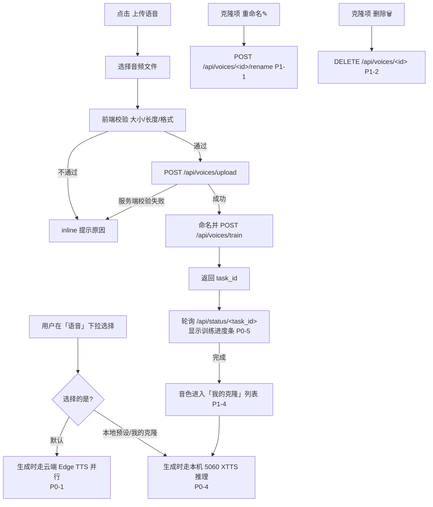

# PRD：图片转视频「并行 TTS + 本地语音克隆（XTTS v2）」

> 文档类型：简单 PRD（产品目标 + 用户故事 + 需求池 + UI 设计稿 + 后端 API 契约草案 + 待确认问题）
> 角色：产品经理（许清楚）　|　语言：中文　|　范围：端到端一次性实现并行 TTS 与本地 XTTS v2 语音克隆
> 现状基线：Web 前端为 Flask 后端 `src/web_server.py` 托管的单页原生 `static/index.html`（非 React）；TTS 硬编码 `VOICE="zh-CN-XiaoxiaoNeural"`，`batch_generate_tts()`（line 927）逐条串行；进度机制 `tasks[task_id].progress/message/status` + 前端每 1.2s 轮询 `/api/status/<task_id>`（line 573）。本 PRD 不改代码。

---

## 1. 项目信息

| 项 | 内容 |
|---|---|
| 项目名（snake_case） | `voice_clone_parallel_tts` |
| 原始需求复述 | 在图片转视频工具中加入：① 默认路径并行化 Edge TTS；② 本地 RTX 5060 上的 XTTS v2 零样本语音克隆；③ 前端「上传语音 / 选择语音 / 重命名 / 删除」能力。语音下拉第一项为「默认(云端 Edge TTS 并行)」，其余为本地 XTTS 说话人（预设 + 用户克隆音色），选中即本地推理。 |
| 克隆引擎 | Coqui XTTS v2（本地零样本，RTX 5060 ~8G 显存，上传数秒~数十秒参考音频即可克隆，无长时训练） |
| 「训练」语义 | 进度条映射为「参考音频加载/编码 + 模型 warm-up/加载」的过程反馈，非长时训练 |
| 技术栈约束 | 前端保持原生 JS（`static/index.html`），不引入 React；后端沿用 Flask + 现有 `tasks` 进度机制 |

---

## 2. 产品目标

**让用户在图片转视频流程中，一键并行生成配音，并可在本机零样本克隆任意说话人音色供后续视频直接复用，全程无需云端训练、无需切换工具。**

---

## 3. 用户故事

| # | 角色 | 故事 | 价值 |
|---|---|---|---|
| a | 默认并行 TTS 用户 | 作为普通用户，我**不关心音色**，只想更快出片，因此选择下拉第一项「默认」，系统自动用云端 Edge TTS **并行**为每段文案配音，比现在串行更快。 | 生成耗时下降，出片效率提升 |
| b | 本地音色用户 | 作为内容创作者，我想用**本地预设/已克隆的说话人**配音，因此在下拉中选择某个 XTTS 音色，系统直接用本机 5060 做本地推理，不依赖网络与额度。 | 稳定、私有、可复用固定声线 |
| c | 上传克隆用户 | 作为需要特定声线的用户，我想**克隆某人的声音**：先选音频文件 → 系统**校验大小与长度** → 通过则「训练」（加载/编码+warm-up，带进度条）→ 训练完成该音色出现在列表 → 我即可在生成时选中它。 | 零成本获得专属且可复用音色 |

---

## 4. 需求池（优先级）

### P0（Must have — 端到端跑通）
| ID | 需求 | 说明 / 验收标准 |
|---|---|---|
| P0-1 | `batch_generate_tts` **并行化** | 默认路径下，将逐条串行改为并发（基于现有 `tts_single_paragraph` 的 async，`asyncio.gather` 或线程池）；总耗时应明显低于串行；保留失败段落重试/兜底（Windows SAPI）。 |
| P0-2 | 语音选择 UI | 右侧「生成」面板新增「语音」分区；下拉/列表含三类：① 默认(云端 Edge TTS 并行) ② 本地 XTTS 预设说话人 ③ 我的克隆；选中即生效。 |
| P0-3 | 上传音频**校验**（大小 + 长度） | 选择文件后立即前端粗校验，再经 `POST /api/voices/upload` 服务端二次校验；不合规明确提示原因（过长/过大/格式不支持）。 |
| P0-4 | XTTS 本地推理接入 | 选中非默认音色时，生成流程调用本机 5060 上的 XTTS v2 推理产出该段音频，替代/并行于 Edge TTS。 |
| P0-5 | 训练进度条 | 「训练」过程复用现有 `tasks` 进度机制（轮询 `/api/status/<task_id>`），展示进度与文案（加载参考音频 → 编码 → 模型 warm-up → 完成）。 |

### P1（Should have — 可用性与持久化）
| ID | 需求 | 说明 / 验收标准 |
|---|---|---|
| P1-1 | 语音**重命名** | 每个自定义（克隆）音色项提供重命名按钮，调用 `POST /api/voices/<id>/rename`，UI 即时更新。 |
| P1-2 | 语音**删除** | 每个自定义音色项提供删除按钮，调用 `DELETE /api/voices/<id>`，删除后从列表移除（默认/预设不可删）。 |
| P1-3 | 语音列表**持久化（存盘）** | 克隆音色元数据写入 `app_data/` 下的清单文件，重启工具后仍在；与生成任务解耦保存。 |
| P1-4 | 训练完成即可被生成任务选用 | 训练成功后的音色立即可在「语音」下拉中选择，并能在 `POST /api/generate` 的 `voice` 字段引用。 |

### P2（Nice to have — 增强）
| ID | 需求 | 说明 |
|---|---|---|
| P2-1 | 多参考音频 | 允许上传多段参考音频提升克隆质量。 |
| P2-2 | 音色**试听** | 列表项提供「播放样例」按钮，快速试听克隆效果。 |
| P2-3 | 批量管理 | 多选重命名/删除、导入导出音色清单。 |

---

## 5. UI 设计稿（文字描述）

### 5.1 布局
在现有右侧「生成」面板（`static/index.html` 的「素材/生成」双栏之「生成」栏）顶部/素材区之后，新增一个 **「🎙️ 语音」分区卡片**，与既有「进度条 `.progress-card`/`.fill`」「日志框」样式保持一致（原生 JS，不引 React）。

### 5.2 分区构成
1. **语音选择下拉/列表**（核心）
   - 第一组：`默认(云端 Edge TTS 并行)`
   - 第二组：`本地预设`（XTTS 模型自带说话人，静态列出）
   - 第三组：`我的克隆`（用户克隆音色，动态列出，每项带重命名✎ / 删除🗑 按钮）
2. **上传按钮** `＋ 上传语音`：点击触发系统文件选择框 → 前端校验格式/大小/时长 → 调 `POST /api/voices/upload` → 通过后弹出「命名并训练」确认 → 调 `POST /api/voices/train`。
3. **训练进度条 + 状态文案**：训练期间在该分区内显示进度条（复用 `.fill`）与文案（参考音频加载 → 编码 → 模型 warm-up → 完成），与全局生成进度条区分。
4. **错误提示**：校验失败（过长/过大/格式不支持）在按钮附近 inline 提示，不进入训练。

### 5.3 交互流（Mermaid）


### 5.4 生成时联动
- 生成任务提交（`POST /api/generate`）新增 `voice` 字段：
  - 值 = `default`（或省略）→ 云端 Edge TTS 并行；
  - 值 = 某 `voice_id`（如 `xtts_preset_x` / `clone_xxx`）→ 本机 XTTS 推理。

---

## 6. 后端 API 契约草案（供架构师参考）

> 沿用 Flask + 现有 `tasks` 进度字典（`progress` 0-100 / `message` / `status`）与 `/api/status/<task_id>` 轮询（line 573）。训练任务直接复用该机制，无需新增状态端点。

### 6.1 列出可用语音
`GET /api/voices`
```json
{
  "voices": [
    {"id": "default",            "name": "默认(云端 Edge TTS 并行)", "type": "cloud_parallel", "status": "ready", "deletable": false},
    {"id": "xtts_preset_1",      "name": "预设-男声A",               "type": "xtts_preset",    "status": "ready", "deletable": false},
    {"id": "clone_abc123",       "name": "我的克隆-小美",            "type": "xtts_clone",     "status": "ready", "deletable": true}
  ]
}
```

### 6.2 上传参考音频并校验
`POST /api/voices/upload` （multipart：`file`）
```json
// 成功
{"ok": true,  "upload_id": "u_abc123", "name": "ref.wav", "duration_sec": 8.2, "size_mb": 1.1}
// 失败
{"ok": false, "reason": "音频过长，上限 60s（当前 95s）"}
```
> 服务端强制二次校验（前端仅粗校验），校验项：格式白名单、大小上限、长度上限。

### 6.3 启动训练（返回 task_id，复用进度轮询）
`POST /api/voices/train`
```json
// 请求
{"upload_id": "u_abc123", "name": "我的克隆-小美"}
// 响应
{"task_id": "t_xyz789", "status": "processing"}
```
- 前端轮询 `GET /api/status/t_xyz789`，进度=加载参考音频→编码→warm-up→完成。
- 完成后该音色出现在 `GET /api/voices`（type=`xtts_clone`，status=`ready`）。

### 6.4 重命名 / 删除
`POST /api/voices/<id>/rename`  →  `{"name": "新名字"}`  →  `200`
`DELETE /api/voices/<id>`        →  `200`（默认/预设不可删；克隆可删，同时清理其模型产物）

### 6.5 生成任务新增 voice 字段
`POST /api/generate`（既有端点，line 524）请求体**新增**：
```json
{ "...既有字段...", "voice": "default" }      // 或 "xtts_preset_1" / "clone_abc123"
```
- `voice` 缺省或 = `default` → 云端 Edge TTS 并行（P0-1）。
- 其他 → 本机 5060 XTTS 推理（P0-4）。

### 6.6 建议存储位置（待确认可调整）
- 清单：`app_data/voices/voices.json`（元数据：id/name/type/status/参考音频路径/产物路径）。
- 克隆产物：`app_data/voices/<id>/`（说话人编码 / checkpoint 等）。
- 临时上传：沿用现有 `app_data/temp_uploads/`。

---

## 7. 待确认问题（需用户 / 架构师拍板）

| # | 问题 | 建议默认值（供决策参考） |
|---|---|---|
| Q1 | **XTTS 模型权重如何分发 / 首次是否自动下载？** 本机无网或首次运行怎么办？ | 首次运行自动从 HuggingFace 下载并缓存到 `app_data/`；提供离线预置包说明。需确认网络环境。 |
| Q2 | **参考音频长度与大小上限？** | 长度 ≤ 60s、大小 ≤ 10MB、单声道 16k/22k WAV/MP3。需架构师按 XTTS 最佳实践确认。 |
| Q3 | **XTTS 预设说话人有哪些？** 列几个、叫什么？ | 建议 2–3 个（如 男声A / 女声B / 中性C），名称待定。 |
| Q4 | **训练产物（模型文件）存于 `app_data` 下哪个子目录？** 单文件 embedding 还是 checkpoint 目录？ | 建议 `app_data/voices/<id>/`，见 6.6。 |
| Q5 | **克隆音色如何与生成任务关联？** 是按任务快照还是全局复用？ | 全局复用：克隆后写入清单，任意后续生成任务通过 `voice=clone_<id>` 引用（P1-4）。 |
| Q6 | **默认并行 TTS 的并发度上限？** 受网络/线程数限制？ | 建议并发 = min(段落数, 8)，失败段落串行重试 + Windows SAPI 兜底。 |
| Q7 | **XTTS 推理与并行 Edge TTS 是否可能同时占用资源？** 5060 显存是否够同时跑 XTTS 推理 + 视频合成 CUDA？ | 需架构师实测 8G 显存下的 XTTS 推理峰值，决定推理时是否暂停视频 CUDA 链。 |
| Q8 | **克隆音色清单的持久化格式与并发安全？** | JSON 清单 + 文件锁；重启后保留（P1-3）。 |
| Q9 | **重命名/删除的边界**：预设说话人能否隐藏或改名？删除克隆是否同时删参考音频？ | 默认/预设不可删不可改名；删除克隆时级联清理其产物，参考音频可保留或一并清理（待定）。 |
| Q10 | **「训练」进度条与全局「生成」进度条如何区分展示？** | 训练期间在「语音」分区内独立进度条；生成期间用原「生成」面板进度条，互不干扰。 |

---

### 附：与现有代码的对齐点（仅供架构师定位，不改代码）
- `src/TOOLBOX.py`: `VOICE`(L105)、`tts_single_paragraph()`(L785, async/edge_tts)、`batch_generate_tts()`(L927, 串行→需并行化)、`synthesize_with_windows_sapi()`(L838, 兜底)。
- `src/web_server.py`: `DATA_ROOT`(L41-44)、`temp_uploads`(L52)、`tasks` 进度字典、`/api/generate`(L524)、`/api/status/<task_id>`(L573)、`allowed_file()`(L208, 可参考做上传校验)。
